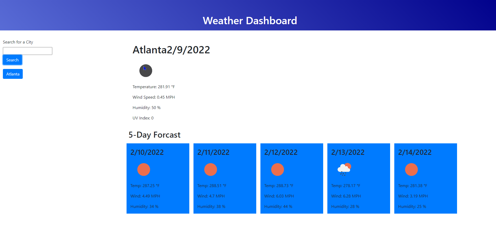

# Weather-Dashboard# 

## Description
This is a weather app that will give you the weather details for a city of your choosing and the 5 day forcast.

## Installation
https://christopherponzio.github.io/Weather-Dashboard
https://github.com/ChristopherPonzio/Weather-Dashboard

## Usage
He is a demonstration of the weather dashboard!

## Credits
1. Michelle Blackwell github: https://github/Mblackwellgca
2. https://stackoverflow.com
3. https://w3schools.com
4. https://momentjs.com/
5. https://api.jquery.com/
6. https://getbootstrap.com/docs/4.6/getting-started/introduction/

## License
MIT License